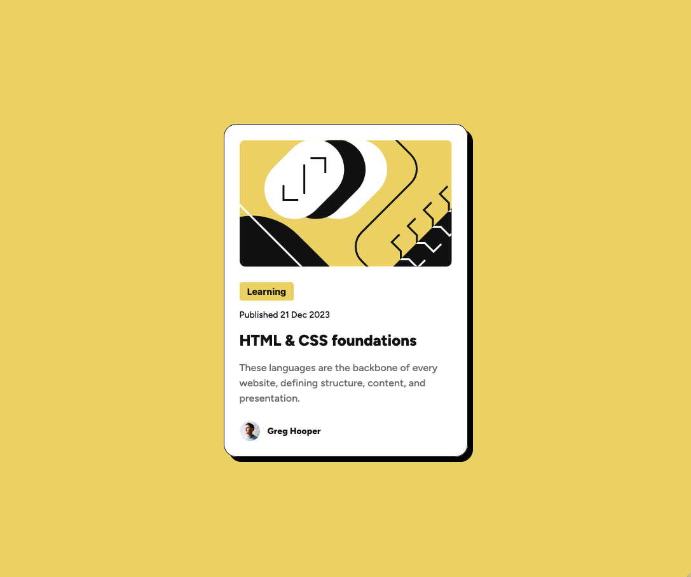

# Frontend Mentor - Blog preview card solution

This is a solution to the [Blog preview card challenge on Frontend Mentor](https://www.frontendmentor.io/challenges/blog-preview-card-ckPaj01IcS). Frontend Mentor challenges help you improve your coding skills by building realistic projects.

## Table of contents

- [Overview](#overview)
  - [The challenge](#the-challenge)
  - [Screenshot](#screenshot)
  - [Links](#links)
- [My process](#my-process)
  - [Built with](#built-with)
  - [What I learned](#what-i-learned)
  - [Useful resources](#useful-resources)
- [Author](#author)

**Note: Delete this note and update the table of contents based on what sections you keep.**

## Overview

### The challenge

Users should be able to:

- See hover and focus states for all interactive elements on the page

### Screenshot



## Links

- Solution URL: [Solution](https://github.com/vince4dev/challenge2)
- Live Site URL: [Live site](https://vince4dev.github.io/challenge2/)

## My process

### Built with

- Semantic HTML5 markup
- CSS custom properties
- Flexbox

### What I learned

This project involved creating a web page simulating a map with information. The goal was to put into practice the knowledge acquired in web development, particularly regarding the use of Flexbox and other CSS properties.

## Points learned:

### Using Flexbox

- In this project, I used Flexbox technology to create a flexible layout for the card elements. This allowed me to easily manage the element layout and adapt it to different devices.

```css
.card {
  display: flex;
  flex-direction: column;
  gap: 24px;
}
```

### Using width: fit-content

- To prevent the button from expanding to fill all available space, I used the `width` property with the value `fit-content`. This allowed me to define a fixed width for the button.

```css
button {
  width: fit-content;
}
```

### Using box-shadow to add a shadow to the map

- I used the box-shadow property to add a shadow to the card. This created a 3D effect that enhances the user experience.

```css
.card {
  box-shadow: 8px 8px 0px rgba(0, 0, 0, 1);
}
```

### Using object-fit to display an image

- To display an image with the correct aspect ratio, I used the `object-fit` property. This allowed me to define how the image is displayed within its container.

```css
.card__img {
  object-fit: cover;
}
```

### Using hover (:hover)

- I used the :hover pseudo-class to add visual effects when a user hovers their mouse over an element. This allowed me to create animations and style changes to enhance the user experience.

```css
button:hover {
  background-color: var(--c-yellow-light);
}

a:hover {
  color: var(--c-yellow-light);
}
```

## Useful resources

- [google-webfonts-helper](https://gwfh.mranftl.com/fonts) - This helped me find the font and integrate it into the project.
- [MDN](https://developer.mozilla.org/fr/) - Resources for Developers.

## Author

- Frontend Mentor - [@vince4dev](https://www.frontendmentor.io/profile/vince4dev)
